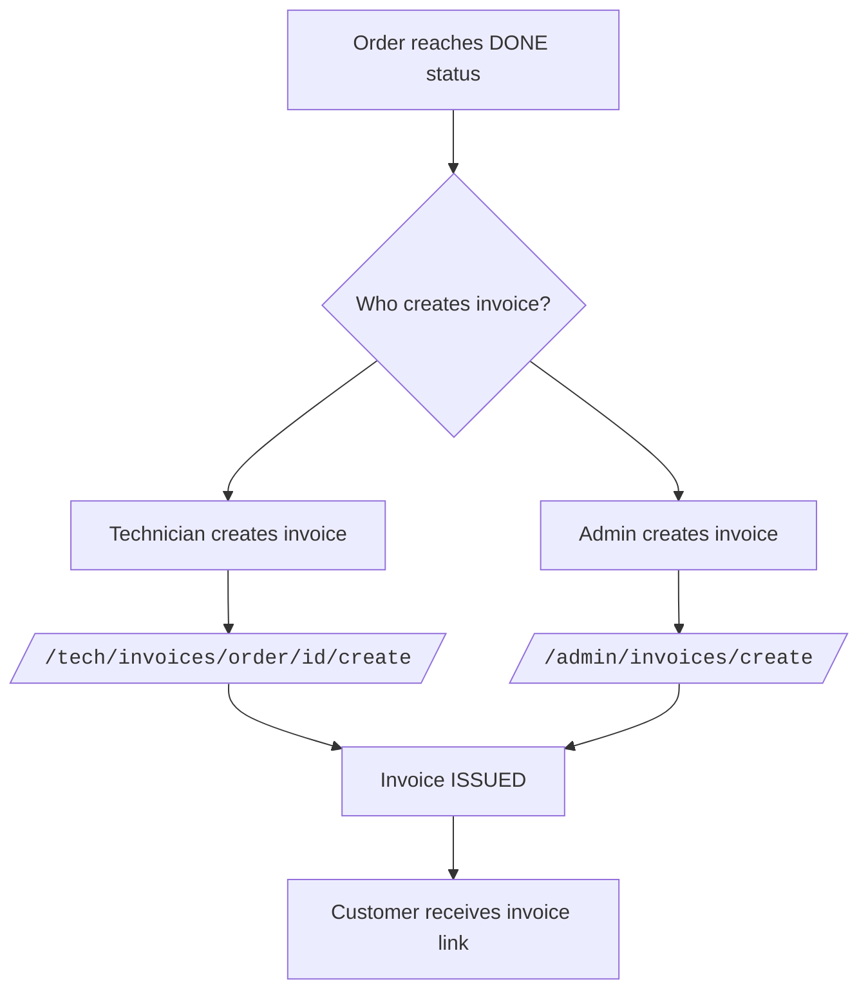

# Invoice and Payment Flow

---

## Invoice Creation Flow



---

## Payment Flow — Online (PSP)

```mermaid
flowchart TD
    A[Customer opens invoice] --> B[Clicks Pay button]
    B --> C[/<code>/invoices/id/pay/ POST]
    C --> D[Payment service creates Payment INITIATED]
    D --> E[Redirect to PSP payment page]
    E --> F{Customer action at PSP}
    F --> G[PSP success callback]
    F --> H[PSP failure callback]
    G --> I[/<code>/payments/callback/ receives callback]
    I --> J[Payment service calls PSP verify endpoint]
    J --> K{Verification result}
    K --> L[Amount matches + success]
    K --> M[Failure or mismatch]
    K --> N[Timeout or ambiguous]
    L --> O[Payment PAID]
    O --> P[Invoice PAID]
    O --> Q[Technician ledger credited]
    O --> R{Platform mode?}
    R --> S[platform_gateway → Platform commission created]
    R --> T[company_gateway → No commission]
    M --> U[Payment FAILED]
    N --> V[Payment NEEDS_RECONCILIATION]
```

---

## Manual / Cash Payment Flow

```
Admin records cash payment at:
/<code>/admin/invoices/<id>/record-payment/ (POST)
  → Invoice → PAID immediately
  → No PSP involved
  → No platform commission created
  → Technician ledger credited
```

---

## Short Invoice Link

Any invoice can be shared via short URL:
```
/i/<public_code>/
```

This is publicly accessible. No login required. Shows invoice for ISSUED or PAID status.

---

## NEEDS_RECONCILIATION Resolution Flow

```
Payment enters NEEDS_RECONCILIATION
  ↓
Platform Owner reviews at /owner-platform/payments/operations/
  ↓
Option A: Manually mark as PAID (if PSP confirms payment)
Option B: Manually mark as FAILED (if PSP confirms failure)
Option C: Request refund (if duplicate payment found)
```

---

## Financial Events Summary

| Event | Creates |
|---|---|
| Invoice created for DONE order | Invoice(ISSUED) |
| Customer pays via PSP | Payment(PAID) + Invoice(PAID) + TechnicianLedgerEntry |
| Platform gateway + fee > 0 | CompanyPlatformFeeEntry |
| Admin records cash payment | Invoice(PAID) + TechnicianLedgerEntry |
| Settlement of technician wage | TechnicianLedgerEntry (debit) |
