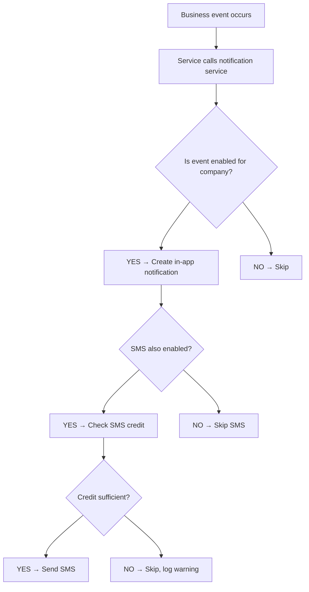

# Notification Flow

---

## Dual Notification System

Rasti has two parallel notification systems:
1. **In-app notifications** — stored in DB, shown in notification bell
2. **SMS notifications** — sent via SMS provider

Both are configurable per company and per event type.

---

## Notification Trigger Flow



---

## Known Notification Gaps

As of 2026-06-30 audit, these events are DEFINED in the catalog but NOT triggered:

| Event | Expected Trigger |
|---|---|
| `order_cancelled` | When order → CANCELLED |
| `order_rescheduled` | When order is rescheduled |
| `order_cancel_requested_customer` | When customer requests cancellation |

These gaps mean customers and technicians may not receive expected notifications for these events.

---

## Technician SMS — Permanently Disabled

`apps/orders/technician_notifications.py:147`:
```python
if False and send_sms and notification_settings.send_sms_on_new_order:
    send_sms_to_technician(...)
```

New order SMS to technicians is permanently disabled. This is a bug.

---

## Platform SMS Notifications

Platform sends SMS for:
- Subscription created/renewed
- SMS credit low/depleted
- KYC status changes

**Known issue:** These always use plain fallback text, never the configured SMS template. Template rendering for platform SMS is not implemented.

---

## Notification Configuration URLs

| URL | Purpose |
|---|---|
| `/<code>/admin/settings/notifications/` | Per-event notification settings |
| `/<code>/admin/communication-settings/` | Company communication event config |
| `/<code>/admin/sms/templates/` | SMS template management |
