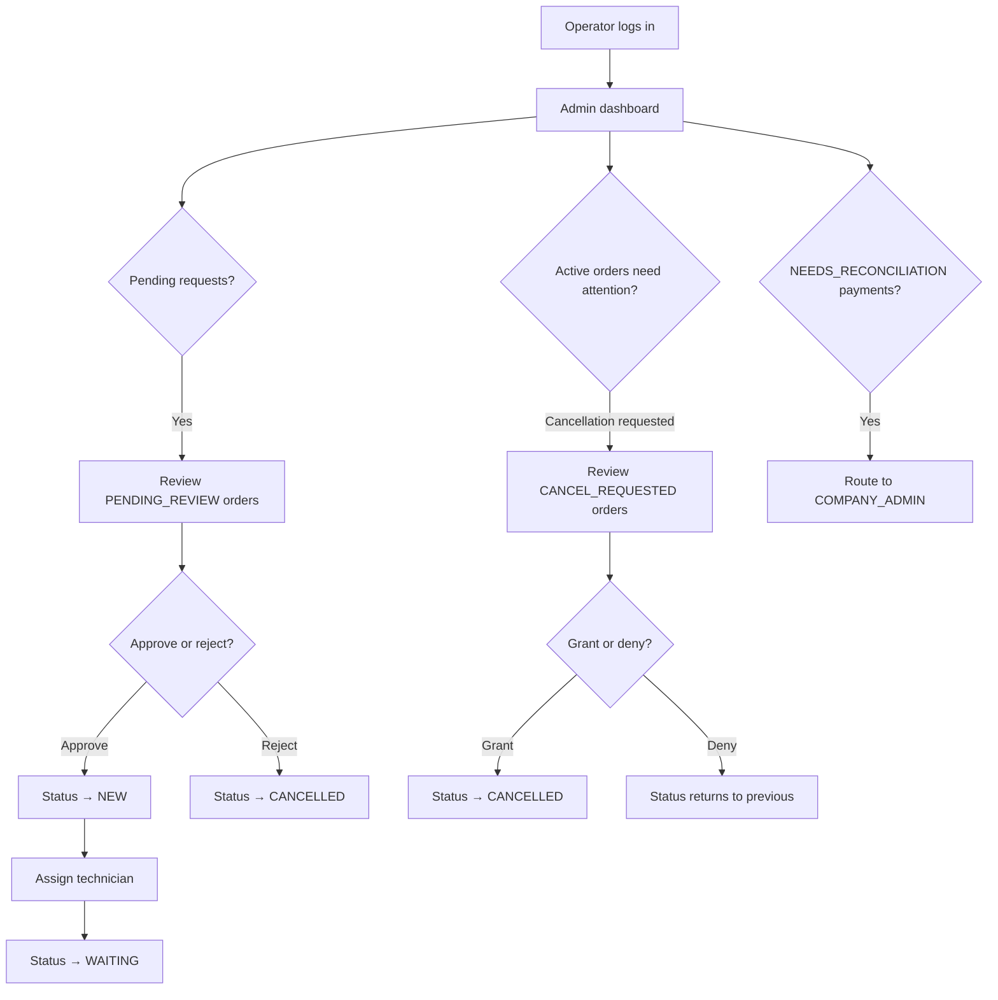

# Operator Review Flow

The operator (COMPANY_STAFF) is the primary daily user of the admin panel. This document describes their daily review workflow.

---

## Operator Role

Operators (`COMPANY_STAFF`) handle:
- Reviewing incoming public requests
- Creating orders directly
- Assigning technicians
- Monitoring order progress
- Handling cancellation requests

They do NOT manage:
- Company settings (admin only)
- Billing and platform fees (admin only)
- Technician wages and ledger (admin only)

---

## Daily Review Workflow

---

## Key Operator URLs

| URL | Action |
|---|---|
| `/{code}/admin/` | Dashboard |
| `/{code}/admin/orders/` | All orders list |
| `/{code}/admin/orders/{id}/` | Order detail |
| `/{code}/admin/orders/{id}/approve/` | Approve pending request |
| `/{code}/admin/orders/{id}/assign/` | Assign technician |
| `/{code}/admin/orders/{id}/cancel/` | Cancel order |
| `/{code}/admin/orders/create/` | Create order directly |

---

## Order Assignment Rules

- Technician must belong to the same company
- Only one technician per order at a time
- To reassign: remove existing technician first (returns to `NEW`), then assign new
- After assignment: order → `WAITING`, technician gets notification

---

## Cancellation Flow

See [CANCELLATION_FLOW.md](CANCELLATION_FLOW.md) for full detail.

Summary:
- Customer or operator can request cancellation
- Status → `CANCEL_REQUESTED`
- Admin reviews and approves → `CANCELLED`
- Or admin denies → reverts to previous status

---

## Escalation Rules

Operators escalate to `COMPANY_ADMIN` for:
- `NEEDS_RECONCILIATION` payments
- Technician wage disputes
- Company settings changes
- Billing issues
