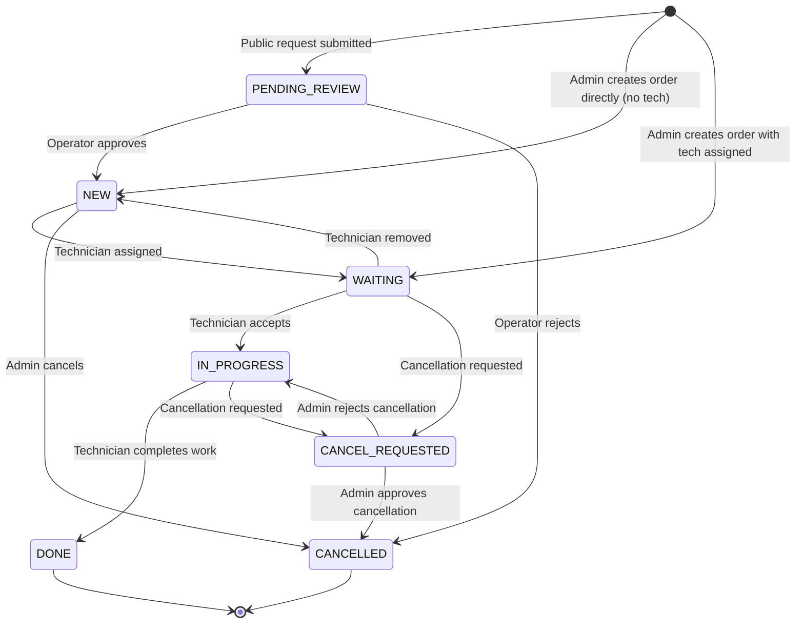

# Order Lifecycle Workflow

---

## Status Machine Diagram



---

## Full Order Flow — Public Request Path

```
Step 1: Customer visits /<code>/request/
  → Fills out public service request form
  → POST creates ServiceRequest + Order(PENDING_REVIEW)

Step 2: Operator at /<code>/admin/requests/
  → Sees new PENDING_REVIEW orders
  → Reviews details
  → Approves → Order(NEW)

Step 3: Admin at /<code>/admin/orders/<id>/assign/
  → Assigns technician → Order(WAITING)

Step 4: Technician at /<code>/tech/orders/available/
  → Sees the order
  → Accepts → Order(IN_PROGRESS)

Step 5: Technician performs work
  → Completes at /<code>/tech/orders/<id>/complete/
  → Order(DONE)

Step 6: Technician at /<code>/tech/invoices/order/<id>/create/
  → Creates Invoice(ISSUED)

Step 7: Customer at /<code>/invoices/<id>/pay/
  → Initiates payment → PSP
  → PSP callback → /<code>/payments/callback/
  → Payment verification → Payment(PAID) + Invoice(PAID)
  → Technician ledger credited
  → Platform commission created (if applicable)
```

---

## Admin Direct Order Flow

```
Admin at /<code>/admin/orders/create/
  → Enters customer, service details
  → Optionally assigns technician
  
  IF no technician → Order(NEW)
  IF technician assigned → Order(WAITING)
  
  → Continues same as steps 4-7 above
```

---

## Key Code Locations

| Step | File | Function |
|---|---|---|
| Public request → Order | `apps/public/views.py` | `service_request_view` |
| Approve request | `apps/tenants/views_admin.py` | `admin_request_approve` |
| Assign technician | `apps/tenants/views_admin.py` | `admin_order_assign` |
| Technician accept | `apps/orders/views.py` | `technician_order_accept` |
| Technician complete | `apps/orders/views.py` | `technician_order_complete` |
| Create invoice | `apps/invoices/views.py` | `technician_invoice_create` |
| Payment initiation | `apps/payments/services.py` | Payment service |
| PSP callback | `apps/payments/views.py` | `payment_callback` |
