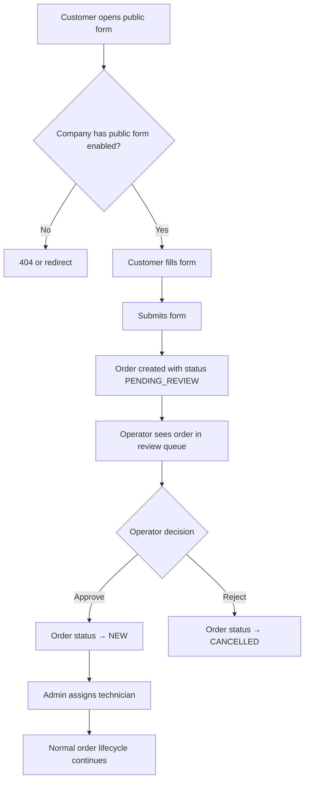

# Public Service Request Flow

The public request form allows customers to submit service requests without being logged in.

---

## Entry Point

URL: `/{company_code}/request/`

This page is publicly accessible — no login required. The company must have the public request form enabled in their settings.

---

## Public Request Flow

---

## Step-by-Step

### 1. Customer Opens Form
- URL: `/{company_code}/request/`
- No authentication required
- Page visible only if company's `ServiceRequestForm` is enabled

### 2. Customer Submits
Customer provides:
- Name
- Contact information (phone)
- Service description
- (Optional: address, preferred time)

### 3. Order Created
- Order created with status `PENDING_REVIEW`
- Customer receives SMS confirmation (if SMS is enabled)
- Operator receives notification of new request

### 4. Operator Reviews
- At `/{code}/admin/orders/pending/` or similar
- Reviews the request details
- Can approve or reject

### 5a. Operator Approves
- Order status → `NEW`
- Normal order lifecycle begins
- Admin can now assign a technician

### 5b. Operator Rejects
- Order status → `CANCELLED`
- Customer may receive SMS if notifications are configured

---

## Key Rules

- The public form can be disabled per company in company settings
- Customer does not need an account — but an account may be created automatically
- Order enters `PENDING_REVIEW` not `NEW` — operator approval is required
- This is the "public path" described in ORDER_RULES.md (2 creation paths)

---

## Admin Creation Path (Alternative)

The second creation path is admin-direct: an operator creates an order directly at `/{code}/admin/orders/create/`. This creates with status `NEW`, skipping `PENDING_REVIEW`.

See [../04_Business_Rules/ORDER_RULES.md](../04_Business_Rules/ORDER_RULES.md) for both paths.
