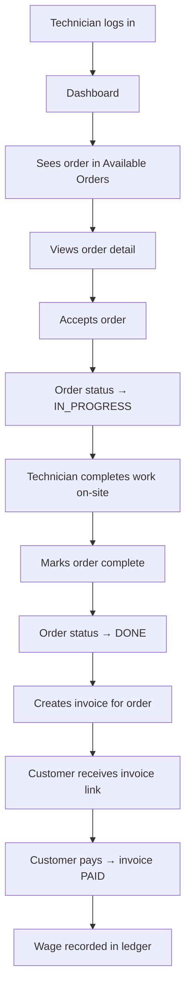

# Technician Workflow

Full step-by-step workflow for a technician from login to order completion and payout.

---

## Technician Panel Entry Points

All technician URLs are under `/{company_code}/tech/`.

| URL | Purpose |
|---|---|
| `/{code}/tech/` | Dashboard (home) |
| `/{code}/tech/orders/available/` | Orders assigned and waiting for acceptance |
| `/{code}/tech/orders/<id>/` | Order detail |
| `/{code}/tech/orders/<id>/accept/` | Accept order |
| `/{code}/tech/orders/<id>/complete/` | Mark order complete |
| `/{code}/tech/invoices/` | Technician's invoices |
| `/{code}/tech/invoices/<id>/create/` | Create invoice for completed order |
| `/{code}/tech/payouts/` | Payout ledger (wages) |

---

## Technician Workflow

---

## Step-by-Step

### 1. Technician Receives Assignment Notification
- Admin assigns technician at `/{code}/admin/orders/{id}/assign/`
- Technician receives in-app notification
- Order status becomes `WAITING`

### 2. Technician Views Available Order
- At `/{code}/tech/orders/available/`
- Sees all orders in `WAITING` status assigned to them

### 3. Technician Accepts Order
- Clicks accept at `/{code}/tech/orders/{id}/accept/`
- Order status → `IN_PROGRESS`
- Acceptance is final — cannot be undone without cancellation

### 4. Technician Completes Work
- Goes to customer site, performs service
- At `/{code}/tech/orders/{id}/complete/`
- Order status → `DONE`

### 5. Technician Creates Invoice
- At `/{code}/tech/invoices/{id}/create/`
- Invoice status → `ISSUED`
- Customer can view invoice at public URL

### 6. Customer Pays
- Customer views invoice at `/{code}/invoices/{id}/`
- Pays via PSP or cash
- Invoice status → `PAID`

### 7. Wage Recorded
- On payment, technician wage is calculated and recorded as `TechnicianLedgerEntry`
- Technician can view payout ledger at `/{code}/tech/payouts/`

---

## Technician Panel Navigation (5 Items)

Bottom navigation bar in the technician mobile panel:
1. Home / Dashboard
2. Available Orders
3. My Orders (in-progress)
4. Invoices
5. Payouts / Wages

---

## Key Business Rules

- Technician can only see orders within their company
- One active technician per order
- Technician cannot reject an assignment — they can only request cancellation
- Wage calculation is determined by `CompanyFinancialPolicy` for the company

---

## Known Issue

**H-1 (Technician SMS):** The SMS notification to technicians when assigned is disabled in code with `if False:` at `apps/orders/services.py:147`. Technicians do not currently receive SMS on assignment — only in-app notifications. See [../11_Project_Knowledge/KNOWN_RISKS.md](../11_Project_Knowledge/KNOWN_RISKS.md).
