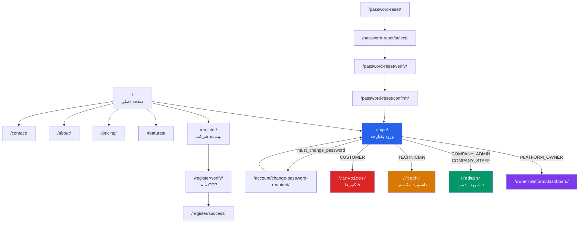
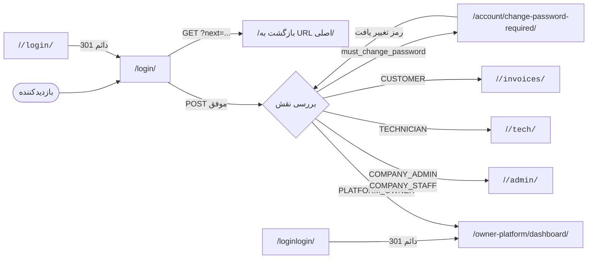
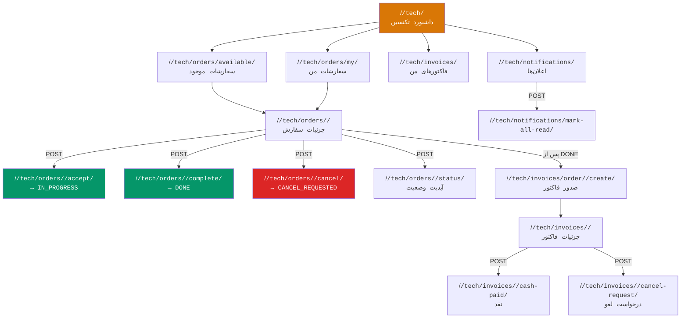
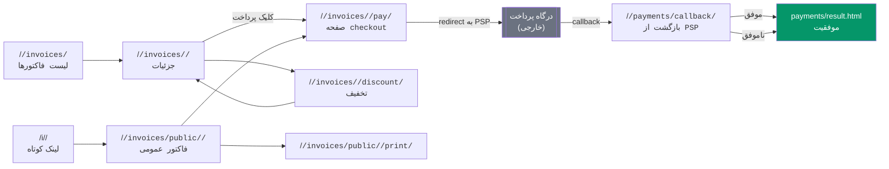
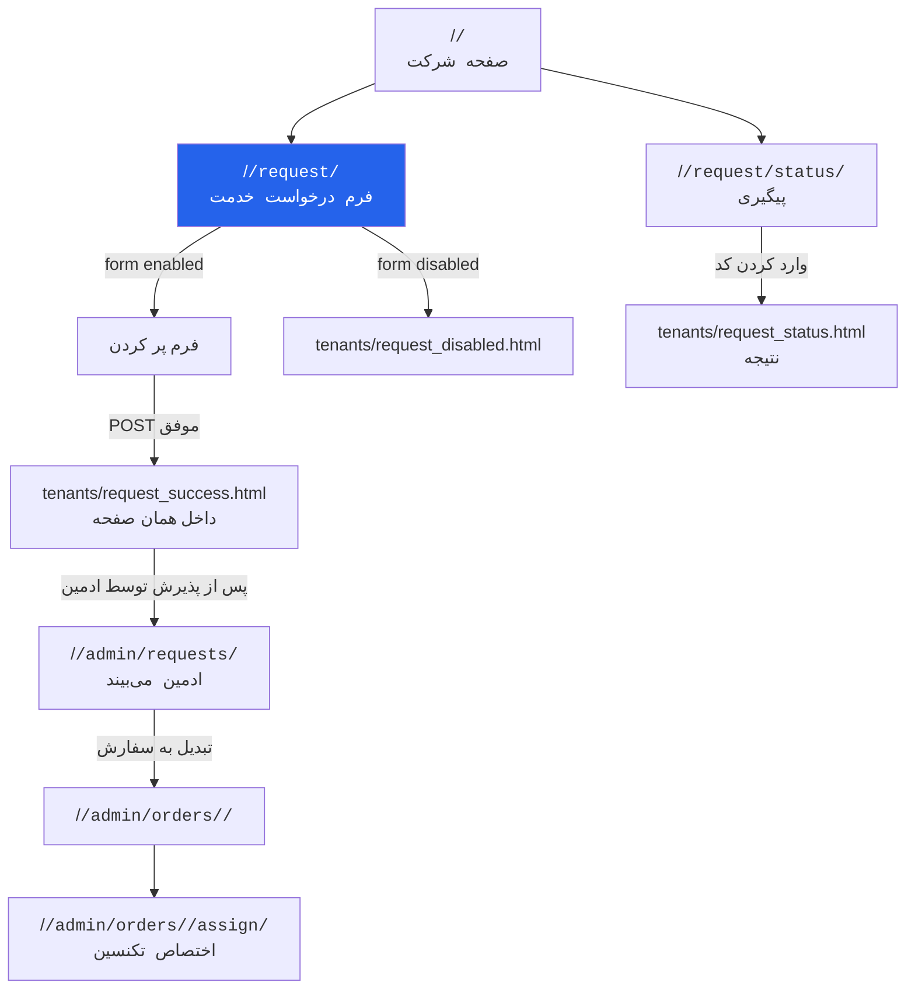
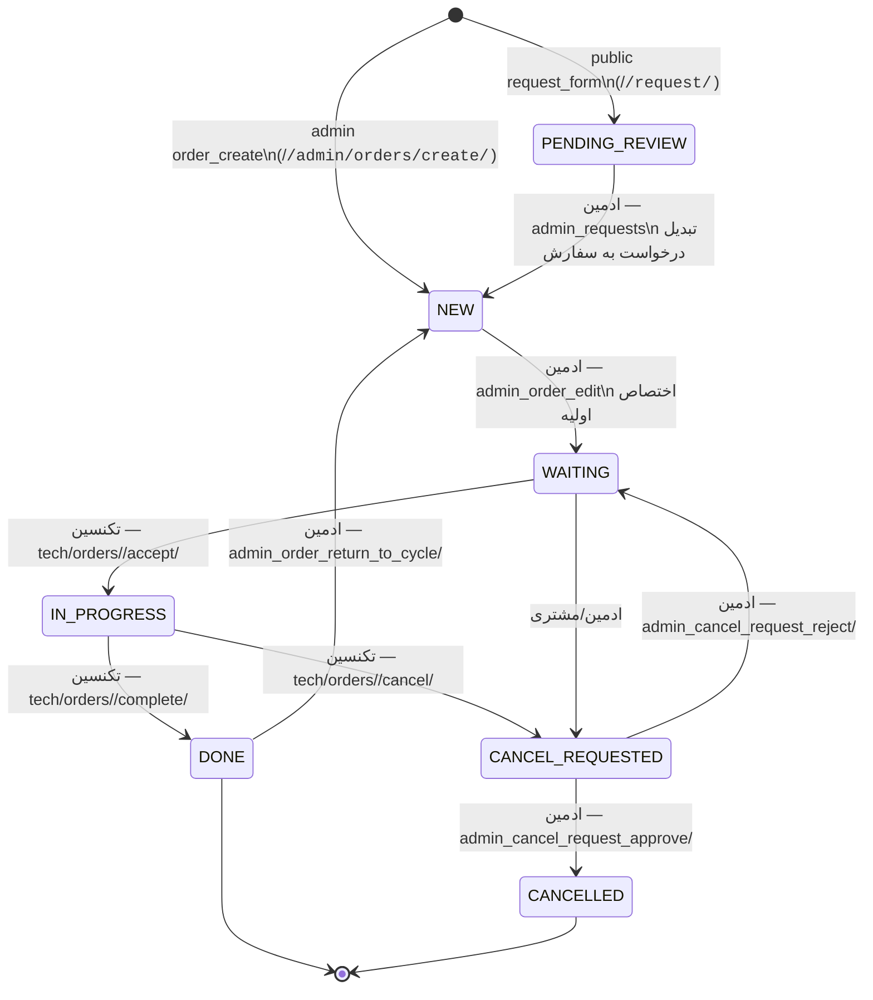
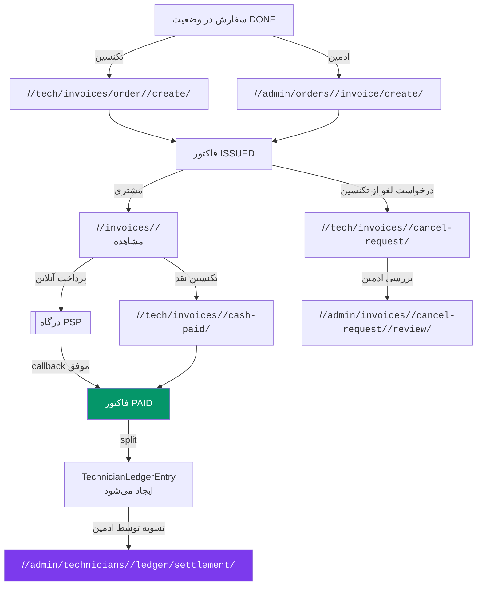
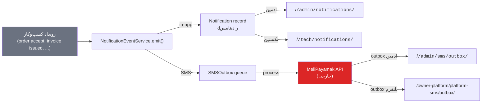

# ۰۳ — گراف ناوبری (Mermaid)

**مبنا:** URL‌های بررسی‌شده، view‌ها، و قالب‌های ناوبری  
**تاریخ:** ۱ ژوئیه ۲۰۲۶

---

## ۱. گراف کلی — ورود و تقسیم نقش‌ها

---

## ۲. جریان احراز هویت و جلسه

---

## ۳. پنل مالک پلتفرم

```mermaid
flowchart TD
    PD["/owner-platform/dashboard/\nداشبورد"] --> COMP["/owner-platform/companies/\nشرکت‌ها"]
    PD --> PLANS["/owner-platform/plans/\nپلن‌ها"]
    PD --> SUBS["/owner-platform/subscriptions/\nاشتراک‌ها"]
    PD --> REP["/owner-platform/reports/\nگزارش‌ها"]

    COMP --> COMP_D["/owner-platform/companies/<id>/\nجزئیات شرکت"]
    COMP --> COMP_C["/owner-platform/companies/create/\nشرکت جدید"]
    COMP_D --> COMP_E["/owner-platform/companies/<id>/edit/"]
    COMP_D --> COMP_T["/owner-platform/companies/<id>/templates/\nقالب‌های ارتباطی"]
    COMP_D -->|فعال‌سازی| COMP_ACT["activate/deactivate"]

    PD --> SMSBILL["/owner-platform/sms-billing/\nاعتبار پیامک"]
    SMSBILL --> SMSBILL_CO["/sms-billing/companies/"]
    SMSBILL --> SMSBILL_INV["/sms-billing/invoices/"]
    SMSBILL_INV --> SMSBILL_INV_D["/sms-billing/invoices/<id>/"]
    SMSBILL_INV_D -->|تأیید پرداخت| SMSBILL_INV_PAID["mark-paid"]

    PD --> PSMS["/owner-platform/platform-sms/\nپیامک پلتفرم"]
    PSMS --> PSMS_OB["/platform-sms/outbox/"]
    PSMS --> PSMS_T["/platform-sms/templates/"]
    PSMS --> PSMS_P["/platform-sms/provider/"]
    PSMS_OB --> PSMS_OB_D["/outbox/<id>/"]

    PD --> MERCH["/owner-platform/merchant-profiles/\nKYC پذیرندگان"]
    MERCH --> MERCH_D["/merchant-profiles/<id>/"]
    MERCH --> MERCH_CR["/merchant-profile-change-requests/"]
    MERCH_CR --> MERCH_CR_D["/change-requests/<id>/\nتأیید/رد"]

    PD --> PAY_OPS["/owner-platform/payments/operations/\nپایش پرداخت"]
    PD --> SPLIT["/owner-platform/payment-split-snapshots/"]
    SPLIT --> SPLIT_D["/payment-split-snapshots/<id>/"]

    PD --> PG["/owner-platform/payment-gateways/\nدرگاه پرداخت"]
    PG --> PG_S["/payment-gateways/settings/"]
    PG --> PG_T["/payment-gateways/test/"]

    PD --> MSG["/owner-platform/messages/\nپیام‌ها"]
    MSG --> MSG_IN["/messages/inbox/"]
    MSG --> MSG_OUT["/messages/outbox/"]
    MSG --> MSG_C["/messages/create/"]
    MSG_IN --> MSG_D["/messages/<id>/"]

    style PD fill:#7c3aed,color:#fff
```

---

## ۴. پنل مدیر/اپراتور شرکت

```mermaid
flowchart TD
    AD["/<code>/admin/\nداشبورد"] --> ORD["/<code>/admin/orders/\nسفارشات"]
    AD --> CUST["/<code>/admin/customers/\nمشتریان"]
    AD --> TECH_LIST["/<code>/admin/technicians/\nتکنسین‌ها"]
    AD --> INV["/<code>/admin/invoices/\nفاکتورها"]
    AD --> REQ["/<code>/admin/requests/\nدرخواست‌ها"]
    AD --> FIN["/<code>/admin/financial-reports/summary/\nگزارش مالی"]
    AD --> SET["/<code>/admin/settings/\nتنظیمات"]
    AD --> SMS_MENU["/<code>/admin/sms/\nپیامک"]
    AD --> NOT["/<code>/admin/notifications/\nاعلان‌ها"]

    ORD --> ORD_C["/<code>/admin/orders/create/"]
    ORD --> ORD_D["/<code>/admin/orders/<id>/"]
    ORD_D --> ORD_E["/<code>/admin/orders/<id>/edit/"]
    ORD_D --> ORD_A["/<code>/admin/orders/<id>/assign/\nاختصاص تکنسین"]
    ORD_D --> ORD_INV["/<code>/admin/orders/<id>/invoice/create/"]
    ORD_D --> ORD_CR_AP["cancel-request/approve/"]
    ORD_D --> ORD_CR_RJ["cancel-request/reject/"]

    CUST --> CUST_D["/<code>/admin/customers/<id>/"]
    CUST --> CUST_L["/<code>/admin/customers/lookup/\n(AJAX)"]

    TECH_LIST --> TECH_C["/<code>/admin/technicians/create/"]
    TECH_LIST --> TECH_D["/<code>/admin/technicians/<id>/edit/"]
    TECH_LIST --> TECH_LED["/<code>/admin/technicians/<id>/ledger/"]
    TECH_LED --> TECH_STMNT["/<code>/admin/technicians/<id>/statement/"]
    TECH_STMNT --> TECH_STMNT_PDF["statement/pdf/"]
    TECH_STMNT --> TECH_STMNT_EXP["statement/export/"]
    TECH_LED --> TECH_SET["/<code>/admin/technicians/<id>/ledger/settlement/"]
    TECH_LIST --> TECH_RATES["/<code>/admin/technicians/rates/"]

    INV --> INV_D["/<code>/admin/invoices/<id>/"]
    INV_D --> INV_E["/<code>/admin/invoices/<id>/edit/"]
    INV_D --> INV_P["/<code>/admin/invoices/<code>/print/"]

    FIN --> FIN_TECH["financial-reports/technicians/"]
    FIN --> FIN_INV["financial-reports/invoices/"]
    FIN --> FIN_CASH["financial-reports/cash-control/"]
    FIN --> FIN_FEE["financial-reports/platform-fees/"]
    FIN --> FIN_AUD["financial-reports/audit/"]

    SET --> SET_NOT["/<code>/admin/settings/notifications/"]
    SET --> SET_OP["/<code>/admin/settings/operators/\n⚠️ بدون decorator"]
    SET --> SET_BD["/<code>/admin/base-data/"]
    SET --> SET_PG["/<code>/admin/payment-gateway/"]
    SET --> SET_COMM["/<code>/admin/communication-settings/"]
    SET --> SET_BRAND["/<code>/admin/branding/"]

    SMS_MENU --> SMS_TPL["/<code>/admin/sms/templates/"]
    SMS_MENU --> SMS_OB["/<code>/admin/sms/outbox/"]
    SMS_MENU --> SMS_DX["/<code>/admin/sms/diagnostics/"]
    SMS_MENU --> SMS_IN["/<code>/admin/sms/inbox/"]
    SMS_MENU --> SMS_CR["/<code>/admin/sms-credit/\nکیف پول"]

    style AD fill:#059669,color:#fff
    style SET_OP fill:#dc2626,color:#fff
```

---

## ۵. پنل تکنسین

---

## ۶. جریان فاکتور و پرداخت (مشتری)

---

## ۷. جریان درخواست خدمت عمومی

---

## ۸. چرخه عمر سفارش (Order Lifecycle)

---

## ۹. جریان ایجاد و تسویه فاکتور

---

## ۱۰. جریان اعلان و پیامک

