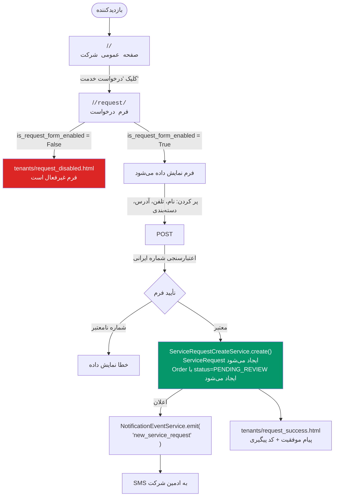
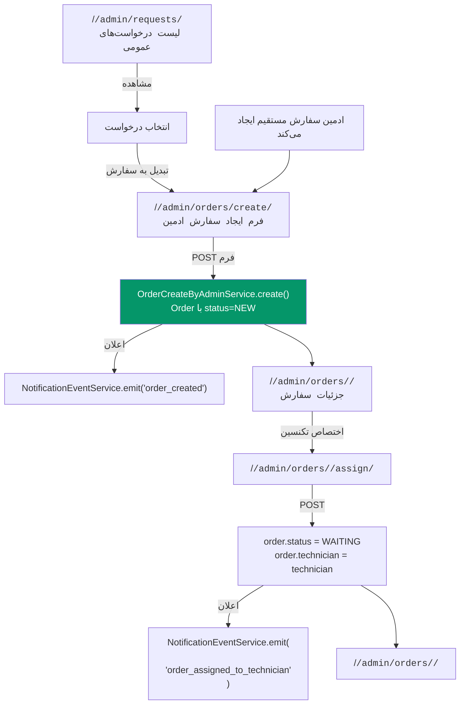
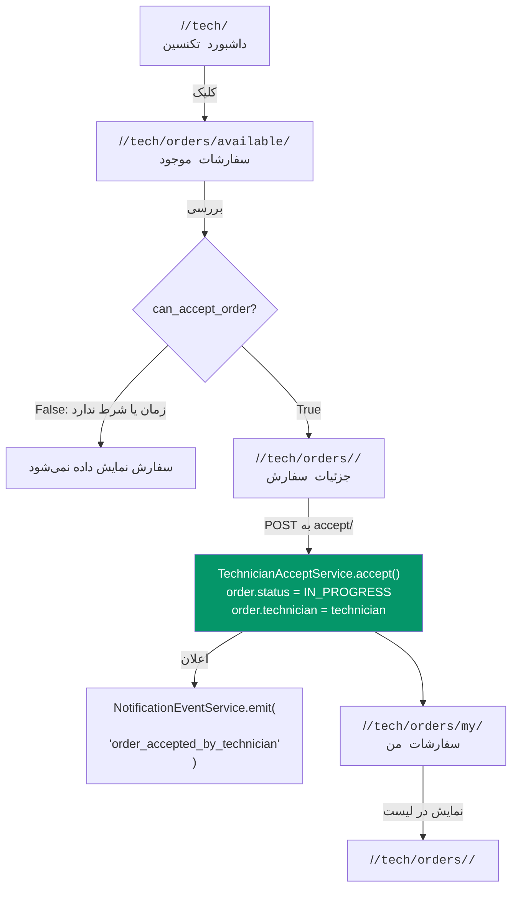
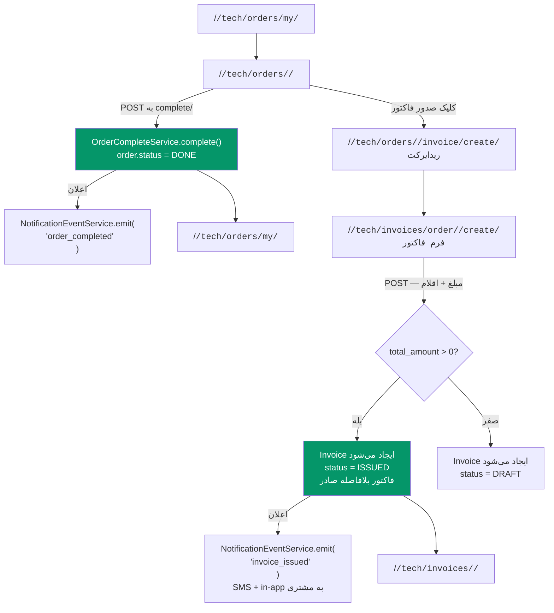
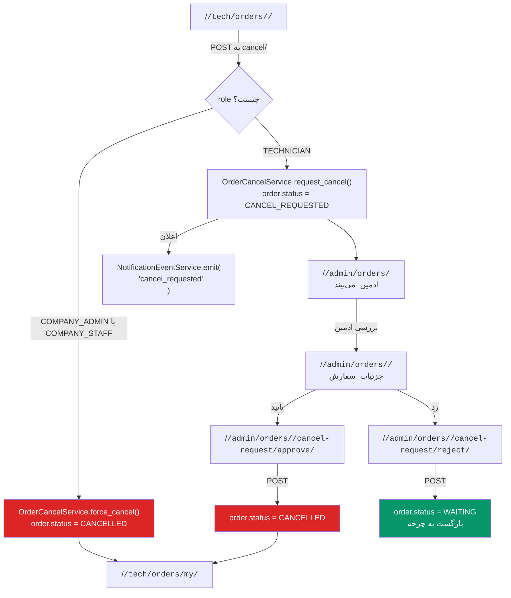
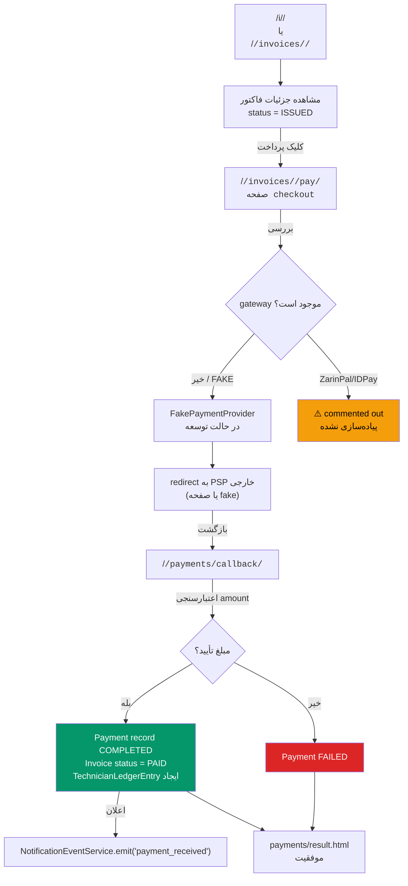
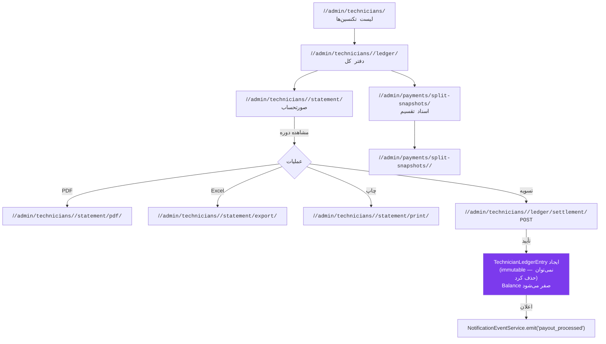
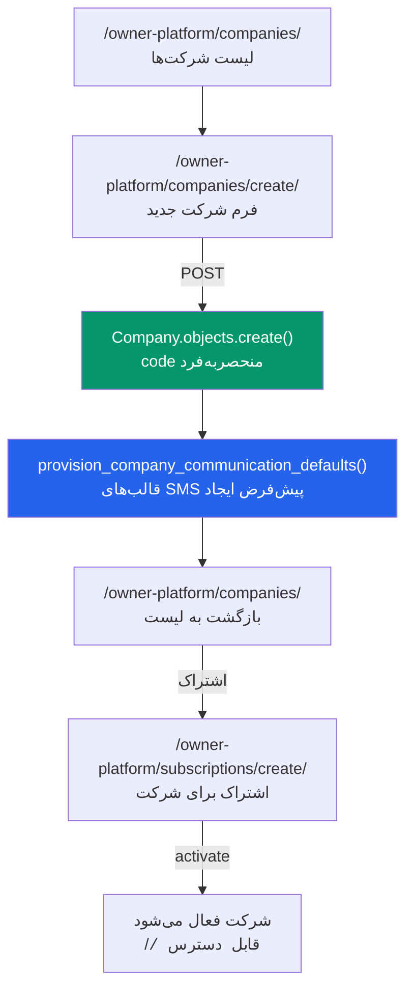
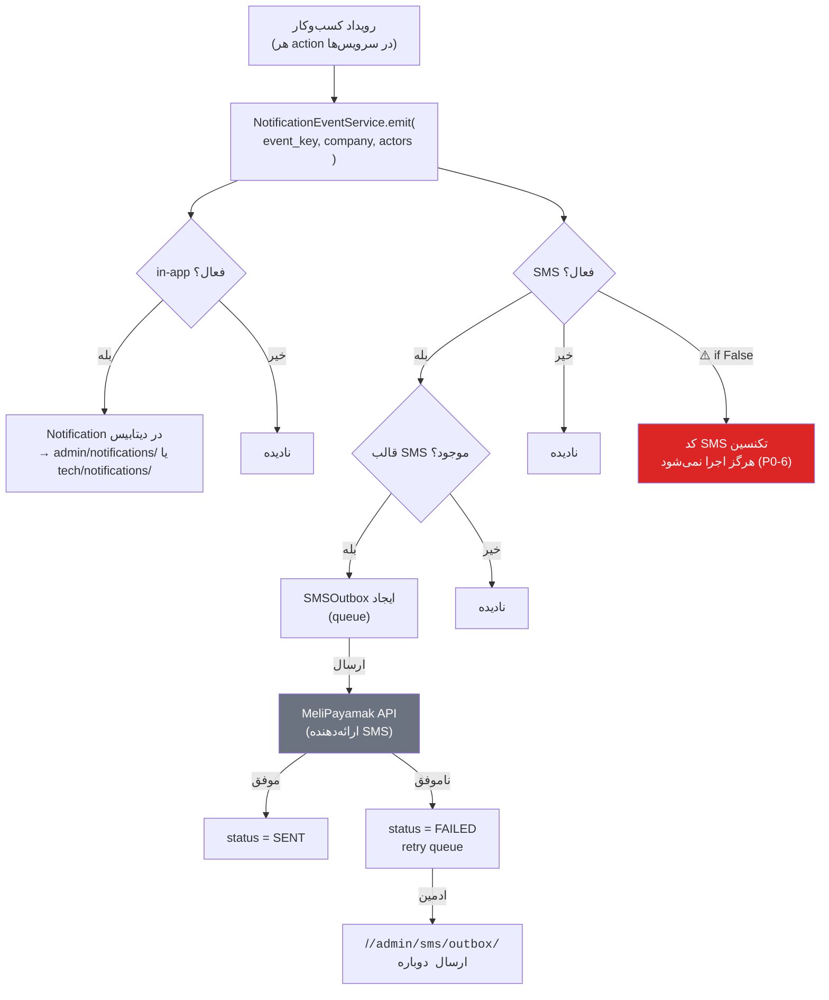
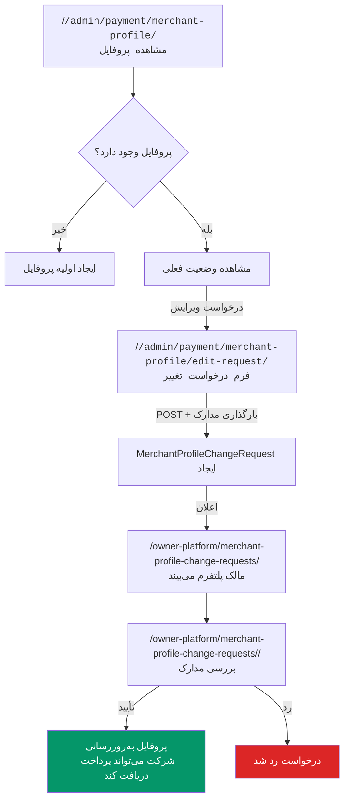

# ۰۴ — نقشه گردش‌کارهای کسب‌وکار

**مبنا:** `apps/tenants/services.py`، `apps/orders/services.py`، `apps/payments/services.py`، URL‌های بررسی‌شده  
**تاریخ:** ۱ ژوئیه ۲۰۲۶

---

## ۱. ثبت درخواست خدمت عمومی

**Actor:** بازدیدکننده / مشتری (بدون auth)  
**مبدأ:** `/<code>/` یا `/<code>/request/`  
**سرویس:** `ServiceRequestCreateService.create()` در `apps/tenants/services.py`

**توجه مهم:** سرویس `ServiceRequestCreateService.create()` هم یک `ServiceRequest` و هم یک `Order` با `status=PENDING_REVIEW` ایجاد می‌کند (مستند در `apps/tenants/services.py:177`).

---

## ۲. بررسی و تبدیل درخواست به سفارش (توسط ادمین)

**Actor:** COMPANY_ADMIN یا COMPANY_STAFF  
**مبدأ:** `/<code>/admin/requests/`

---

## ۳. پذیرش سفارش توسط تکنسین

**Actor:** TECHNICIAN  
**مبدأ:** `/<code>/tech/orders/available/`

---

## ۴. تکمیل سفارش و صدور فاکتور

**Actor:** TECHNICIAN  
**مبدأ:** `/<code>/tech/orders/my/`

---

## ۵. درخواست لغو سفارش و بررسی

**Actor:** TECHNICIAN یا COMPANY_ADMIN (force cancel)  
**مبدأ:** `/<code>/tech/orders/<id>/`

---

## ۶. جریان پرداخت آنلاین

**Actor:** CUSTOMER یا بازدیدکننده (از لینک عمومی)  
**مبدأ:** `/<code>/invoices/<id>/` یا `/i/<public_code>/`

---

## ۷. تسویه با تکنسین (Payout)

**Actor:** COMPANY_ADMIN  
**مبدأ:** `/<code>/admin/technicians/<id>/ledger/`

---

## ۸. ثبت شرکت جدید (توسط مدیر پلتفرم)

**Actor:** PLATFORM_OWNER  
**مبدأ:** `/owner-platform/companies/create/`

---

## ۹. جریان پیامک و اعلان

**مبنا:** `apps/notifications/services.py`، `apps/sms/services.py`

---

## ۱۰. جریان KYC / پروفایل پذیرنده

**Actor:** COMPANY_ADMIN → PLATFORM_OWNER  
**مبدأ:** `/<code>/admin/payment/merchant-profile/`

---

## خلاصه جریان‌های اصلی

| # | جریان | Actor اصلی | تعداد URL درگیر |
|---|-------|-----------|----------------|
| 1 | ثبت درخواست خدمت | بازدیدکننده | 2 |
| 2 | تبدیل درخواست به سفارش | COMPANY_ADMIN/STAFF | 3 |
| 3 | پذیرش سفارش | TECHNICIAN | 3 |
| 4 | تکمیل + صدور فاکتور | TECHNICIAN | 4 |
| 5 | درخواست لغو | TECHNICIAN + COMPANY_ADMIN | 4 |
| 6 | پرداخت آنلاین | CUSTOMER | 4 + PSP خارجی |
| 7 | تسویه با تکنسین | COMPANY_ADMIN | 4 |
| 8 | ثبت شرکت جدید | PLATFORM_OWNER | 3 |
| 9 | پیامک و اعلان | (سیستم) | async |
| 10 | KYC / پذیرنده | COMPANY_ADMIN + PLATFORM_OWNER | 4 |
