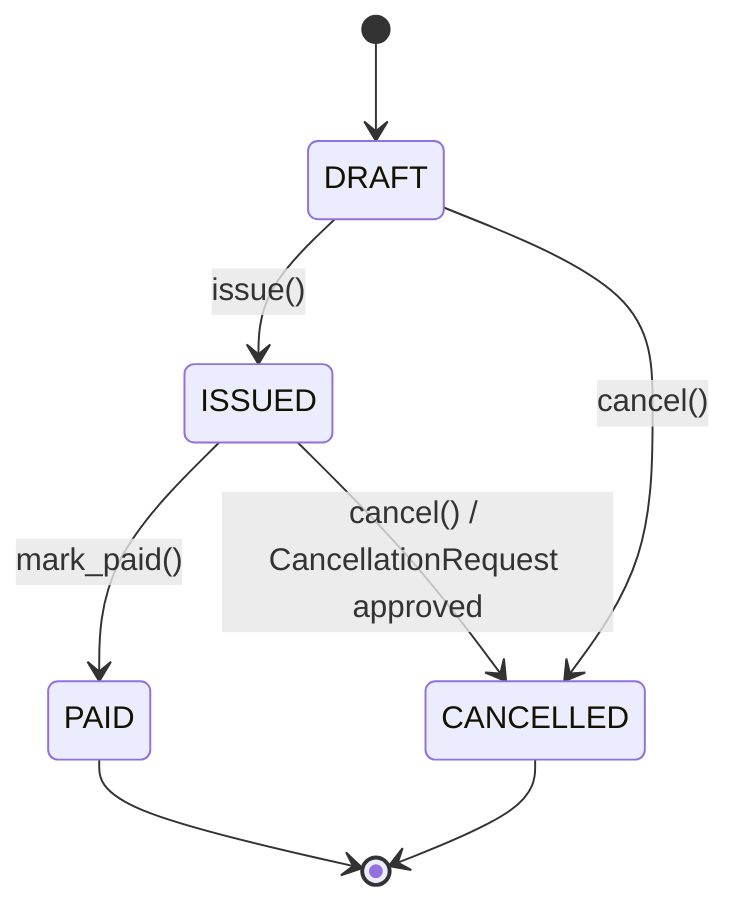
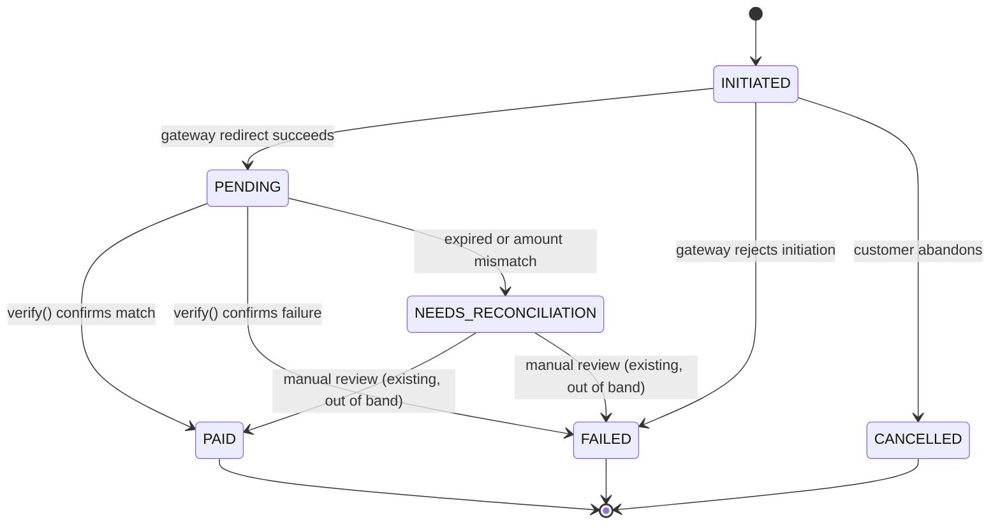
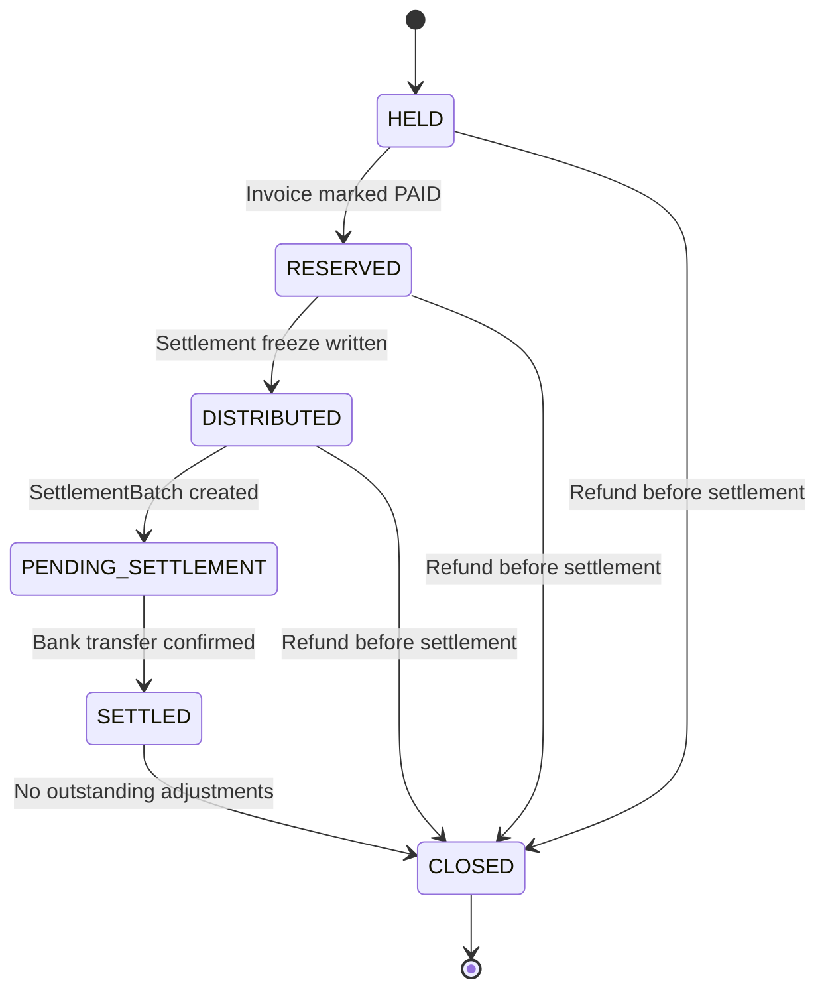
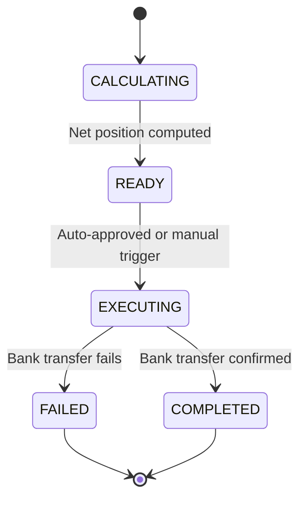
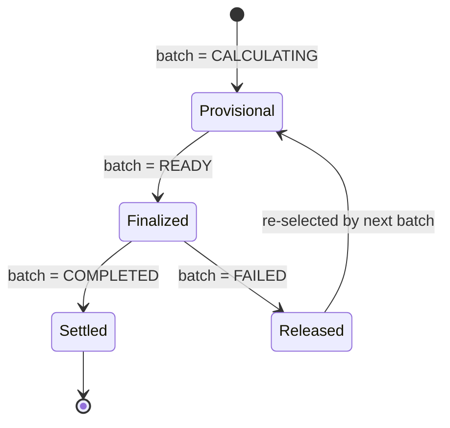
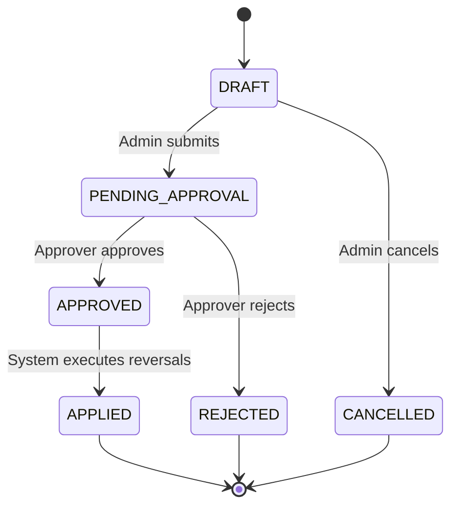
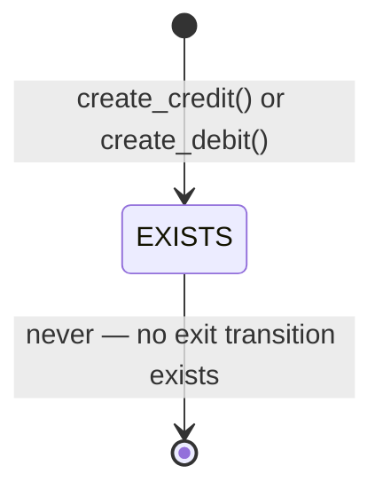
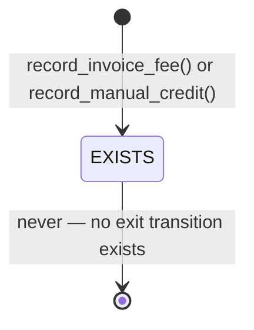

# 25 — مشخصات ماشین حالت مالی (Financial State Machine Specification)

**Version:** v1.0 — Draft — Pending Clarification

**Purpose:**
This document defines the formal state machine for every financial
model in the RastiSaas Financial Engine, existing and target.

**Terminology mapping used throughout this document:**

| Domain term | Codebase term |
|---|---|
| Organization | Company (`apps/tenants/models.Company`) |
| Provider | Technician (`apps/accounts/models.Technician`) |
| Platform | RastiSaas platform owner (system-level) |
| Customer | `apps/accounts/models.Customer` |

**Grounding:**
This document is derived from:

- `docs/13_Financial_Core/05_GAP_ANALYSIS.md`
- `docs/13_Financial_Core/target_architecture/04_DOMAIN_MODEL.md`
- `docs/13_Financial_Core/target_architecture/13_SETTLEMENT_NETTING_ENGINE.md`
- `docs/13_Financial_Core/target_architecture/19_DATA_MODEL.md`
- `docs/13_Financial_Core/target_architecture/24_MONEY_LIFECYCLE_SPECIFICATION.md`

Models marked **(target)** do not exist in the codebase today.
Their state machines are proposed designs, not implemented behavior.

---

## Table of Contents

1. Invoice
2. Payment
3. EscrowRecord (target)
4. SettlementBatch (target)
5. SettlementItem (target)
6. AdjustmentDocument (target)
7. TechnicianLedgerEntry
8. CompanyPlatformFeeEntry

---

## 1. Invoice

### State List

- `DRAFT`
- `ISSUED`
- `PAID`
- `CANCELLED`

### Mermaid Diagram

### Allowed Transitions

| From | To | Triggering Service |
|---|---|---|
| — | `DRAFT` | `InvoiceCreateService.create()` |
| `DRAFT` | `ISSUED` | `InvoiceIssueService.issue()` |
| `DRAFT` | `CANCELLED` | `InvoiceCancelService.cancel()` |
| `ISSUED` | `PAID` | `InvoiceMarkPaidService.mark_paid()` |
| `ISSUED` | `CANCELLED` | `InvoiceCancelService.cancel()` or approved `InvoiceCancellationRequest` |

### Forbidden Transitions

- `PAID` → any other state. No service performs this transition;
  `Invoice.recalculate_totals()` explicitly raises `ValueError`
  if `status == PAID`.
- `CANCELLED` → any other state. Terminal.
- `DRAFT` → `PAID` directly. Must pass through `ISSUED` first;
  enforced by `InvoiceMarkPaidService.mark_paid()` raising
  `ValueError` if `status != ISSUED`.

### Preconditions

- `DRAFT → ISSUED`: `total_amount > 0`.
- `ISSUED → PAID`: `payment.amount == invoice.total_amount`;
  `invoice.settled_at is None`.
- `ISSUED → CANCELLED`: no `PAID` payment exists for the invoice.

### Postconditions

- `ISSUED`: `technician_*_wage_percent_snapshot` fields frozen.
- `PAID`: all 17 `settled_*` fields frozen; `paid_at` set.
- `CANCELLED`: `notes` field appended with cancellation reason.

### Events Emitted

- `ISSUED` → `INVOICE_ISSUED_CUSTOMER`
- `PAID` → `INVOICE_PAID_CUSTOMER`
- `CANCELLED` → `INVOICE_CANCELLED`

### Idempotency Key

None at the model level. `InvoiceMarkPaidService.mark_paid()`
is idempotent by construction: calling it twice on an already-PAID
invoice raises `ValueError` rather than silently re-processing.

### Failure Handling

- Row-level lock (`select_for_update()`) prevents two concurrent
  `mark_paid()` calls from double-processing the same invoice.

### Recovery Strategy

Not applicable at the Invoice level itself — recovery for
downstream ledger/fee writes triggered by `mark_paid()` is handled
by `FinancialBackfillTask` (see Section 7 and 8 of this document).

---

## 2. Payment

### State List

- `INITIATED`
- `PENDING`
- `PAID`
- `FAILED`
- `CANCELLED`
- `NEEDS_RECONCILIATION`

### Mermaid Diagram

### Allowed Transitions

| From | To | Triggering Service |
|---|---|---|
| — | `INITIATED` | `PaymentStartService.start()` |
| `INITIATED` | `PENDING` | `PaymentStartService.start()` (gateway success) |
| `INITIATED` | `FAILED` | `PaymentStartService.start()` (gateway rejection) |
| `INITIATED` | `CANCELLED` | Customer abandons before redirect |
| `PENDING` | `PAID` | `PaymentVerifyService.verify()` |
| `PENDING` | `FAILED` | `PaymentVerifyService.verify()` |
| `PENDING` | `NEEDS_RECONCILIATION` | `PaymentVerifyService.verify()` (expiry or mismatch) |
| `NEEDS_RECONCILIATION` | `PAID` or `FAILED` | Manual review (Platform Owner, out of band) |

### Forbidden Transitions

- `PAID` → any other state. `PaymentVerifyService.verify()` returns
  `True, "Payment already verified."` immediately if status is
  already `PAID` — it never re-processes or reverses.
- `FAILED` → `PAID` directly, without going through
  `NEEDS_RECONCILIATION` or a new `Payment` record. No such
  code path exists.
- `CANCELLED` → any other state. Terminal.

### Preconditions

- `PENDING → PAID`: `response.verified_amount == payment.amount`;
  payment not expired (`created_at + 30min > now()`).
- `PENDING → NEEDS_RECONCILIATION`: either expired, or
  `response.verified_amount != payment.amount`.

### Postconditions

- `PAID`: `tracking_code` and `paid_at` set;
  triggers `InvoiceMarkPaidService.mark_paid()` if
  `payment.invoice.status == ISSUED`.
- `NEEDS_RECONCILIATION`: no ledger writes occur; invoice
  remains `ISSUED`.

### Events Emitted

- `PAID` → `PAYMENT_SUCCESS_CUSTOMER`, `PAYMENT_SUCCESS_ADMIN`,
  `PAYMENT_SUCCESS_OPERATOR`
- `FAILED` → `PAYMENT_FAILED_CUSTOMER`
- `INITIATED` → `PAYMENT_STARTED`

### Idempotency Key

None on `Payment` itself, but `select_for_update()` on the
`Payment` row inside `PaymentVerifyService.verify()` and
`PaymentCallbackService.handle_callback()` prevents duplicate
concurrent verification of the same payment.

### Failure Handling

- Amount tampering is treated as a security event
  (logged at `ERROR` level) and routed to
  `NEEDS_RECONCILIATION`, never silently accepted.

### Recovery Strategy

Manual review at `/owner-platform/payments/operations/`
(Platform Owner resolves `NEEDS_RECONCILIATION` cases).
No automated recovery exists for this state today.

---

## 3. EscrowRecord (target)

**Status:** Not yet implemented. See `04_DOMAIN_MODEL.md` §9
and `19_DATA_MODEL.md` — EscrowRecord.

### State List

- `HELD`
- `RESERVED`
- `DISTRIBUTED`
- `PENDING_SETTLEMENT`
- `SETTLED`
- `CLOSED`

### Mermaid Diagram

### Allowed Transitions

| From | To | Triggering Service (target) |
|---|---|---|
| — | `HELD` | `PaymentVerifyService.verify()` (platform gateway) |
| `HELD` | `RESERVED` | `InvoiceMarkPaidService.mark_paid()` |
| `RESERVED` | `DISTRIBUTED` | `InvoiceSettlementService.settle()` |
| `DISTRIBUTED` | `PENDING_SETTLEMENT` | `SettlementCalculationService` |
| `PENDING_SETTLEMENT` | `SETTLED` | `SettlementExecutionService` |
| `SETTLED` | `CLOSED` | Periodic closure check |
| `HELD`/`RESERVED`/`DISTRIBUTED` | `CLOSED` | Refund before settlement (see Document 26) |

### Forbidden Transitions

- No state may skip directly to `CLOSED` from `SETTLED` without
  first satisfying "no outstanding adjustments."
- `CLOSED` → any other state. Terminal — a subsequent refund
  after closure must create a **new** correction record, never
  reopen this one (Principle 6 and 13, Document 23).
- `PENDING_SETTLEMENT` → `HELD`. No reverse transitions exist.

### Preconditions

- `HELD → RESERVED`: `Invoice.status == PAID`.
- `DISTRIBUTED → PENDING_SETTLEMENT`:
  `paid_at + settlement_delay_hours <= now()`.
- `PENDING_SETTLEMENT → SETTLED`: bank transfer confirmed by
  `SettlementBatch.status == COMPLETED`.

### Postconditions

- `DISTRIBUTED`: `platform_commission_rial`,
  `organization_share_rial`, `provider_share_rial` populated,
  summing to `amount_rial`.
- `SETTLED`: `settlement_batch` FK populated.

### Events Emitted (target)

- `HELD` → `escrow_reserved`
- `SETTLED` → part of `settlement_completed` (see Document 26 §13)

### Idempotency Key (target)

`OneToOneField` on `payment` — mirrors the existing
`PaymentSplitSnapshot` pattern, guaranteeing at most one
`EscrowRecord` per `Payment`.

### Failure Handling (target)

Escrow creation failure must not block `Payment.status = PAID`;
must follow the same non-blocking, backfill-task pattern already
used for `TechnicianLedgerEntry` and `CompanyPlatformFeeEntry`
creation failures.

### Recovery Strategy (target)

A new `FinancialBackfillTask.TaskType.ESCROW_RECORD` value would
extend the existing recovery framework (ADR-008) rather than
introducing a separate recovery mechanism.

---

## 4. SettlementBatch (target)

**Status:** Not yet implemented. See `04_DOMAIN_MODEL.md` §10
and `13_SETTLEMENT_NETTING_ENGINE.md`.

### State List

- `CALCULATING`
- `READY`
- `EXECUTING`
- `COMPLETED`
- `FAILED`

### Mermaid Diagram

### Allowed Transitions

| From | To | Triggering Service (target) |
|---|---|---|
| — | `CALCULATING` | `process_settlements` command starts period |
| `CALCULATING` | `READY` | `SettlementCalculationService.create_batch_for_company()` |
| `READY` | `EXECUTING` | Auto-approve (R44) or manual trigger |
| `EXECUTING` | `COMPLETED` | `SettlementExecutionService` bank transfer confirmed |
| `EXECUTING` | `FAILED` | `SettlementExecutionService` bank transfer fails |

### Forbidden Transitions

- `COMPLETED` → any other state. Terminal — a later refund must
  create a new batch or `AdjustmentDocument`, never reopen this one.
- `FAILED` → `COMPLETED` directly. Must go through a **new**
  batch creation cycle; the failed batch's items become
  re-eligible per the selection query, but the failed batch
  itself never transitions again.
- `CALCULATING` → `EXECUTING` directly, skipping `READY`.
  Net position must be fully computed and reviewable before
  execution begins.

### Preconditions

- `CALCULATING → READY`: all eligible `SettlementItem` rows
  created; `net_amount_rial`, `items_count`, `total_credits`,
  `total_debits` populated.
- `READY → EXECUTING`: no concurrent batch exists for the same
  `(company, level, period)` — enforced via advisory lock.

### Postconditions

- `COMPLETED`: `executed_at` and `bank_reference` set;
  corresponding ledger CREDIT/DEBIT entries created
  (`CompanyPlatformFeeEntry` for Layer 1,
  `TechnicianLedgerEntry` for Layer 2).
- `FAILED`: `failure_reason` set; items remain linked but
  become eligible for the next batch's selection query.

### Events Emitted (target)

- `READY` → `settlement_batch_created`
- `EXECUTING` → `settlement_batch_executing`
- `COMPLETED` → `settlement_completed`
- `FAILED` → `settlement_failed`

### Idempotency Key (target)

Advisory lock per `(company, level)` during creation, combined
with the `SettlementItem` exclusion query
(`LEFT JOIN ... WHERE si.id IS NULL`), ensures no invoice is
double-counted across concurrent batch creation attempts.

### Failure Handling (target)

Calculation failure rolls back the entire transaction —
no partial `SettlementBatch` or `SettlementItem` persists.
Execution failure marks the batch `FAILED` without deleting
its items (audit trail preserved).

### Recovery Strategy (target)

`process_settlements` management command retries from scratch
on the next scheduled run. `FAILED` batches require manual
review at `/owner-platform/settlements/` before a retry is
triggered (per `13_SETTLEMENT_NETTING_ENGINE.md` — Retry Schedule).

---

## 5. SettlementItem (target)

**Status:** Not yet implemented. See `04_DOMAIN_MODEL.md` §11
and `13_SETTLEMENT_NETTING_ENGINE.md`.

### State List

`SettlementItem` has no independent status field of its own.
Its lifecycle state is derived entirely from its parent
`SettlementBatch.status`. This is an intentional design choice
to avoid redundant, potentially inconsistent state.

| Parent batch status | Effective item state |
|---|---|
| `CALCULATING` | Provisional (may still be added/removed) |
| `READY` | Finalized (no further changes) |
| `EXECUTING` | Finalized, awaiting transfer confirmation |
| `COMPLETED` | Settled — permanently associated with this batch |
| `FAILED` | Released — eligible for inclusion in a future batch |

### Mermaid Diagram

### Allowed Transitions

Transitions are entirely driven by the parent `SettlementBatch`
state machine (Section 4). `SettlementItem` rows are created once,
during `CALCULATING`, and are never individually transitioned.

### Forbidden Transitions

- A `SettlementItem` may never be re-parented to a different
  `SettlementBatch` while its original batch is not `FAILED`.
- A `SettlementItem` belonging to a `COMPLETED` batch may never
  be selected by a future batch's eligibility query.

### Preconditions

- Creation requires the invoice (or ledger entry) to pass the
  Inclusion Criteria defined in
  `13_SETTLEMENT_NETTING_ENGINE.md` — Settlement Item Selection
  Rules.

### Postconditions

- `amount_rial` on the item is fixed at creation time and never
  recalculated, consistent with the Immutable Ledger principle
  (Document 23, Principle 6) applied to settlement records.

### Events Emitted

None independently — covered by the parent `SettlementBatch`
events.

### Idempotency Key

No `UNIQUE` constraint on `invoice` at the model level
(by design — see `19_DATA_MODEL.md`, SettlementItem).
Idempotency is enforced procedurally via the selection query's
`LEFT JOIN ... WHERE si.id IS NULL` exclusion, scoped to
non-`FAILED` batches only.

### Failure Handling

If the parent batch fails, `SettlementItem` rows are preserved
for audit purposes and are not deleted — consistent with R51
(no financial record may ever be deleted).

### Recovery Strategy

Automatic — the next `process_settlements` run re-evaluates
eligibility and picks up released items without manual
intervention.

---

## 6. AdjustmentDocument (target)

**Status:** Not yet implemented. See `04_DOMAIN_MODEL.md` §12
and `19_DATA_MODEL.md` — AdjustmentDocument.
Full refund/reversal semantics are detailed in
`26_REFUND_REVERSAL_ENGINE_SPECIFICATION.md`.

### State List

- `DRAFT`
- `PENDING_APPROVAL`
- `APPROVED`
- `APPLIED`
- `REJECTED`
- `CANCELLED`

### Mermaid Diagram

### Allowed Transitions

| From | To | Triggering Service (target) |
|---|---|---|
| — | `DRAFT` | Admin creates |
| `DRAFT` | `PENDING_APPROVAL` | Admin submits |
| `DRAFT` | `CANCELLED` | Admin cancels |
| `PENDING_APPROVAL` | `APPROVED` | Approver approves |
| `PENDING_APPROVAL` | `REJECTED` | Approver rejects |
| `APPROVED` | `APPLIED` | `RefundExecutionService` (target) |

### Forbidden Transitions

- `APPLIED` → any other state. Terminal, per Principle 6
  (Immutable Ledger) — a mistaken adjustment must be corrected
  by a **new** `AdjustmentDocument`, never by editing this one.
- `REJECTED` → `APPROVED` directly. A rejected document cannot
  be revived; a new document must be created if the correction
  is still needed.
- `DRAFT` → `APPLIED` directly, skipping approval. No such
  path is defined — approval is mandatory for every adjustment,
  pending resolution of
  [OPEN-ISSUE: OI-08] on whether a *second* approval step
  is additionally required for certain adjustment types.

### Preconditions

- `original_invoice.status == PAID` at creation time. Adjustments
  are not applicable to unpaid invoices (which should instead
  use `InvoiceCancelService.cancel()`).
- `amount_rial <= original_invoice.total_amount` for refund-type
  documents.
- `reason` field is non-empty — mandatory justification (R50).

### Postconditions

- `APPLIED`: `technician_ledger_entry` and `platform_fee_entry`
  FKs populated, pointing to the newly created reversal entries.
  `applied_at` timestamp set.
- `APPROVED`: `approved_by` and `approved_at` set.

### Events Emitted (target)

- `PENDING_APPROVAL` → `refund_requested`
- `APPROVED` → `refund_approved`
- `APPLIED` → `refund_issued`
- `REJECTED` → no dedicated event proposed; internal notification
  only, consistent with existing low-severity internal events

### Idempotency Key (target)

Not yet defined at the model level. Recommended pattern,
consistent with existing ledger idempotency keys:
`adjustment:{document_id}:apply`, checked before executing
reversal ledger writes, to guard against duplicate application
if the applying service is retried.

### Failure Handling (target)

If reversal ledger writes fail mid-application, the document
must remain in `APPROVED` (not `APPLIED`) so that retry logic
can safely re-attempt the full reversal sequence without
double-applying any partial writes that did succeed —
mirroring the two-phase pattern in `FinancialBackfillService`
(ADR-008).

### Recovery Strategy (target)

Extend `FinancialBackfillTask.TaskType` with an
`ADJUSTMENT_APPLICATION` value, reusing the existing recovery
command (`process_financial_backfill`) rather than building a
parallel recovery mechanism.

### Related Open Issues

[OPEN-ISSUE: OI-05], [OPEN-ISSUE: OI-06], [OPEN-ISSUE: OI-07],
[OPEN-ISSUE: OI-08] — see `26_REFUND_REVERSAL_ENGINE_SPECIFICATION.md`
for full detail on each.

---

## 7. TechnicianLedgerEntry

### State List

`TechnicianLedgerEntry` has no status field at all —
its lifecycle is a single state: `EXISTS` (immutable, permanent).
This is intentional: an append-only ledger row is never expected
to transition between states; it either exists or it does not.

### Mermaid Diagram

### Allowed Transitions

| From | To | Triggering Service |
|---|---|---|
| — | `EXISTS` | `TechnicianLedgerService.create_credit()` or `.create_debit()` |

### Forbidden Transitions

- `EXISTS` → deleted. `delete()` unconditionally raises
  `PermissionError`.
- `EXISTS` → modified. `save()` raises `PermissionError` if
  `amount_rial` or `balance_after` differ from the original
  values on any update to an existing row.

### Preconditions

- `idempotency_key` must not already exist in the table
  (checked inside the write transaction, with
  `select_for_update()` locking the technician's most recent row
  first to serialize `balance_after` computation).

### Postconditions

- `balance_after` reflects the running balance immediately after
  this entry, computed as
  `current_balance ± amount_rial` depending on `entry_type`.

### Events Emitted

None directly from the model. Downstream notification events
(`INVOICE_PAID_CUSTOMER`, etc.) are emitted by the calling service
(`InvoiceMarkPaidService`), not by the ledger write itself.

### Idempotency Key

`idempotency_key` — globally unique, DB-enforced
(`unique=True, db_index=True`). Examples:
`invoice:{id}:technician_credit`,
`direct_gateway_settlement:payment:{id}`,
`technician_service_wage:order:{id}`.

### Failure Handling

A concurrent writer racing past the `exists()` idempotency check
triggers an `IntegrityError` on the DB `UNIQUE` constraint.
This is caught inside a savepoint, and the already-committed row
is re-fetched and returned instead of raising to the caller.

### Recovery Strategy

If the enclosing service call (e.g. `mark_paid()`) fails after
this write but before completing its other side effects, the
existing entry remains valid (per Principle 11, Idempotency) and
a `FinancialBackfillTask(TECHNICIAN_LEDGER)` is created to retry
the remaining work — the retry calls
`create_invoice_entries()` again, which skips any entry whose
`idempotency_key` already exists.

---

## 8. CompanyPlatformFeeEntry

### State List

Identical single-state model to `TechnicianLedgerEntry`
(Section 7): `EXISTS` (immutable, permanent).

### Mermaid Diagram

### Allowed Transitions

| From | To | Triggering Service |
|---|---|---|
| — | `EXISTS` | `PlatformFeeService.record_invoice_fee()` (DEBIT) |
| — | `EXISTS` | `PlatformFeeService.record_manual_credit()` (CREDIT) |

### Forbidden Transitions

- Identical to `TechnicianLedgerEntry`: no delete, no mutation
  of `amount_rial` or `balance_after` after creation.

### Preconditions

`record_invoice_fee()` requires all four conditions of the
ADR-003 gate to hold simultaneously:

- `CompanyPaymentSettings.payment_mode == "platform_gateway"`
- `Payment.status == "paid"`
- `PaymentGateway.owner_type == "platform"`
- `CompanyFinancialPolicy.platform_fee_percent > 0`

### Postconditions

- `balance_after` reflects the running commission balance owed
  by the Organization to the Platform.
- `platform_fee_percent_snapshot` freezes the rate used,
  independent of any later policy change (Principle 9,
  Forward-only Policy Changes).

### Events Emitted

None directly. Consistent with Section 7.

### Idempotency Key

`idempotency_key` — globally unique, DB-enforced. Example:
`platform_fee:invoice:{invoice.id}`.

### Failure Handling

`record_invoice_fee()` raises `PlatformFeeRecordingFailed` on
failure — this exception is explicitly documented as one that
must never be silently swallowed, since it represents a
potential platform revenue loss if unhandled.

### Recovery Strategy

`FinancialBackfillTask(PLATFORM_FEE)` is created by the caller
(`InvoiceMarkPaidService.mark_paid()`) on failure, retried by
`process_financial_backfill`, using the same idempotent
`record_invoice_fee()` call.

---

## Cross-Model Recovery Summary

All target and existing models in this document share a single
recovery philosophy, defined by ADR-008 and extended consistently
in this specification:

- Every financial write is idempotent via a deterministic key.
- Every failure creates a `FinancialBackfillTask`
  (existing four types, plus target `ESCROW_RECORD` and
  `ADJUSTMENT_APPLICATION` types proposed in this document).
- Retry handlers call the underlying service unconditionally
  and rely entirely on the service's own idempotency check —
  never checking "was this already done?" at the handler level.
- No recovery mechanism ever mutates or deletes a prior record;
  recovery always means "finish creating the missing record,"
  never "fix the existing one."
